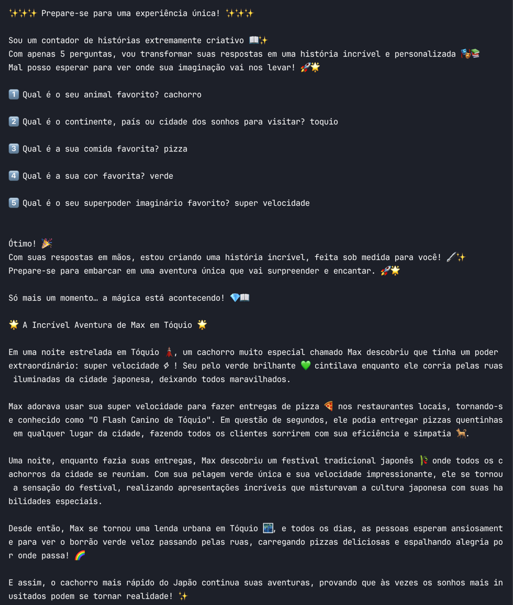

## How to setup

To simplify and manage python versions, first install [Pyenv](https://github.com/pyenv/pyenv?tab=readme-ov-file#installation)

In the project root and with pyenv installed, run the commands

```shell
pyenv install 3.12.3
pyenv shell 3.12.3
python -m venv .venv
source .venv/bin/activate
pip install -r requirements.txt
```

You can just

```shell
python main.py
```

