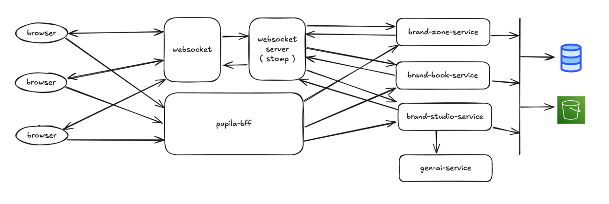

## Documento de decisões arquiteturais

### Contexto

A Pupila é uma plataforma especializada que automatiza a geração de assets visuais baseados em brand books. O sistema integra-se com serviços de IA generativa para produção de imagens e mantém consistência com as diretrizes de marca estabelecidas.

### Requisitos

- **Escalabilidade**: Suporte ao crescimento em número de usuários e requisições para geração de assets.
- **Baixa latência**: Respostas rápidas, especialmente em operações de IA e canvas.
- **Integração com serviços de IA generativa**: Para sugestão de textos e geração de imagens.
- **Consistência de dados**: Os assets e as identidades de marca devem refletir as diretrizes armazenadas no Brand Zone.
- **Experiência de uso rica**: Similar a ferramentas como Figma e Miro, com interações em tempo real para o Brand Zone.
- **Manutenção de estado**: Para edições de marca e histórico de geração de assets.
- **Segurança**: Garantia de privacidade e proteção das diretrizes de marca e assets gerados.

### Fluxo de dados

#### Brand Zone

- O usuário cria ou edita o brand book ( frontend com webSocket ).
- Alterações são salvas em um banco relacional ( PostgreSQL ).

#### Brand Studio

- O usuário insere prompts para gerar novos assets.
- O backend enriquece o prompt com informações do brand book e consulta o(s) serviço(s) de IA para gerar o asset.
- Os assets gerados são armazenados no S3, e as referências são salvas no banco relacional.

